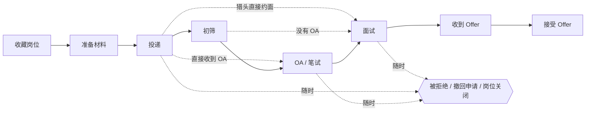

# 求职进度细化与状态回退方案

日期：2026-09-11  
范围：产品与技术方案，尚未实现。

> **2026-09-12 更新：本方案的交互形式已被「事件驱动的时间线」取代。**
> 下面第 9 节说明换代内容；第 1–8 节保留为历史记录——它描述的固定流程界面
> （「更新进度」弹窗：目标阶段选择器 + 子状态选择器 + 推进/回退/更正分组）
> 已经从产品里移除。其**数据模型**（11 个大阶段、子状态列、追加式事件审计、
> 更正语义）仍然在用，只是不再由用户直接操作。

## 1. 建议结论

保留现有大阶段，在需要区分「轮到我做事」和「等对方反馈」的阶段增加子状态。用户直接看到并选择「准备 OA」「已完成 OA · 等结果」「准备面试」「已完成面试 · 等反馈」等具体进度；看板和整体统计仍按大阶段归类。

同时补齐所有阶段的回退能力，并区分两种操作：

- **流程实际退回**：追加一次真实变更，保留已投递、已参加面试等历史事实。
- **之前选错了**：更正错误记录，重新计算有效进度，不把误操作算成真实经历。

OA 指 Online Assessment。针对投递后自动收到 OA 的使用场景，允许「已投递 → 准备 OA」，不要求先经过初筛，也不把收到 OA 当成已通过简历筛选。不是每个岗位都必须有 OA，阶段顺序只作建议。

## 2. 当前实现与问题定位

以下为代码检查结果，未进行运行时复现。

| 位置 | 现状及影响 |
| --- | --- |
| `frontend/src/lib/status.ts` | 目前有 11 个状态；`assessment` 统一显示为「笔试作业」，`interviewing` 统一显示为「面试中」，不能区分准备和完成后的等待。 |
| `frontend/src/lib/transitions.ts` | 前端维护目标白名单。虽然已有「回退 / 更正」分组，但部分状态根本没有回退选项。 |
| `backend/internal/applications/domain/domain.go` | 后端也限制流转边。例如允许 `interviewing → assessment`，但不允许 `preparing → saved`、`applied → preparing`、`offer → interviewing`；只改前端无法解决。 |
| `backend/internal/applications/service/service.go` | `Transition` 回到 `saved/preparing` 时清空 `submitted_at` 和 `first_response_at`，会影响历史事实与统计。`Correct` 虽然提供历史更正，但仍按受限流转规则验证。 |
| `backend/internal/applications/repository/events_extra.go` | 已有更正事件和快照重算机制，可扩展复用；需要统一普通变更、更正、统计的有效历史口径。 |
| `frontend/src/components/StageTrail.tsx` | 进度条主要按阶段顺序填充，容易让跳过的阶段看起来也已完成；最早到达日期也无法表达多轮 OA 或面试。 |
| `frontend/src/lib/types.ts` | 已有面试轮次、日程、待办及事件结构；面试 `result` 不足以单独表达「面完了但结果未知」。 |

因此，回退问题是流转规则不完整，且涉及数据语义，不只是按钮缺失。

## 3. 具体进度设计

### 3.1 状态清单

| 大阶段 | 建议显示的具体进度 | 定义与下一步 |
| --- | --- | --- |
| 待投递 `saved` | 待投递 | 已收藏，尚未开始准备。 |
| 准备材料 `preparing` | 准备材料；材料就绪 · 待投递 | 区分仍在改简历与已经可以提交，避免准备好的岗位被遗忘。 |
| 已投递 `applied` | 已投递 · 等回复 | 等招聘方消息；跟进日期通过待办记录，无需再建「已跟进」状态。 |
| OA / 作业 `assessment` | **准备 OA；已完成 OA · 等结果** | 准备包含收到邀请后尚未开始，以及进行中但尚未提交；已完成以提交成功为准。 |
| 初筛沟通 `screening` | 待安排初筛；准备初筛；已完成初筛 · 等反馈 | 区分等对方定时间、准备电话沟通、沟通结束后的等待。**排在 OA 之后**：投递后自动收到 OA 是主路径，电话沟通通常发生在笔试通过、安排面试之前；把它排在已投递和 OA 之间会让最普通的「投递 → OA」在工序线上留一个永远填不上的空洞。 |
| 面试 `interviewing` | 待安排面试；准备面试；已完成面试 · 等反馈 | 绑定具体轮次，一面完成后可进入二面待安排或准备，不表示所有面试结束。 |
| Offer `offer` | 待评估 Offer；协商 Offer；待确认接受 | 「待确认接受」表示决定接受但还没正式答复；正式接受后进入现有 `accepted`。 |
| 结果 | 已接受；被拒绝；已撤回；岗位关闭 | 保留现有结果类型；「拒绝 Offer」归为主动撤回，并记录原因，不记成被拒绝。 |

子状态建议键：`preparing/invited/awaiting_schedule/completed/ready/reviewing/negotiating/ready_to_accept` 等应按所属阶段定义枚举；最终以独立字典列出合法组合，不能让同一个标签跨阶段产生歧义。OA 首期明确采用 `assessment + preparing/completed`。

初筛的「准备初筛」和面试的「准备面试」允许暂时没有确定时间，不强迫用户补造日程。已知时间再记录即可。

### 3.2 OA 的操作体验

1. 收到邀请：选择「准备 OA」，可补充收到时间、截止时间、计划开做时间、测试链接和备注。
2. 准备或开做：仍保持「准备 OA」。首期不增加低频的「正在做 OA」按钮，避免一次短测试要频繁切状态；如需计时，未来增加可选开始时间。
3. 提交成功：点击「标记 OA 已完成」，记录实际完成时间，显示「已完成 OA · 等结果」。完成时间预填现在，可修改；历史时间不详允许标记未知，不伪造精确时间。
4. 后续消息：可转入面试、收到拒信，或在明确通过但尚未安排下一步时记录本轮结果为「通过」，显示「OA 已通过 · 等下一步」。这不是新增大阶段。
5. 收到另一份测评：新增 OA 轮次，当前显示新一轮的「准备 OA」，保留上一轮完成记录。

记录位置：OA 轮次的收到 / 计划 / 截止 / 完成四种时间统一在详情抽屉的「OA / 作业」面板维护（「＋ 新增一轮」）。「更新进度」弹窗只负责阶段与具体进度 —— 内联一整块轮次表单会让每次改状态都要面对 8 个用不上的控件，同一件事也不该在两个表单里填两遍；子状态变更仍会同步该阶段已有轮次的进度。

示例：9 月 11 日收到 OA，计划 13 日做，截止 16 日；11—13 日显示「准备 OA」，13 日提交后显示「已完成 OA · 等结果」。收到、计划、截止、完成四种时间各自保存，互不覆盖。

测评类型可选「在线测试 / Take-home 作业 / 其他」，作业显示「准备作业 / 已提交作业」。同样区分准备与提交，不强迫所有测评都叫 OA。

### 3.3 面试与多轮活动

复用已有面试轮次，补充分离的活动进度和结果：

- 活动进度：待安排、准备中、已完成、已取消。
- 结果：未知、通过、未通过。
- 时间：收到邀请、计划时间、实际完成时间；时间已过不等于已经参加。

「完成面试」不能自动标为通过，「某轮未通过」也不应未经用户确认就结束整个申请。取消日程不等于撤回申请。

OA 新增轮次记录，至少保存类型、名称、进度、结果及上述时间。申请保留一个当前关注轮次引用；如果同时有未完成 OA 和已安排面试，列表主标签展示用户选定的关注阶段，旁边提示「另有 1 项待完成」，详情同时展示全部活动。不要用最后编辑的活动自动覆盖主进度。

### 3.4 暂不增加的状态

「简历改了一半」「刚打开测试」「发过跟进邮件」「准备面试题」放进待办或时间线；它们不足以改变招聘进度。「长时间没回复」「截止已过」作为提示，不自动改为被拒绝或岗位关闭。背调、签约、入职暂不扩大本次范围。

## 4. 回退与更正规则

### 4.1 所有阶段都能重新选择

「更新进度」提供完整目标选择，按「下一步建议 / 返回其他阶段 / 结束申请」组织，默认展开当前大阶段的子状态。

- 任意非终态可前进、跳过或返回其他非终态，包括「准备材料 → 待投递」「OA → 已投递」「Offer → 面试」。排序只影响推荐，不决定权限。
- 同一大阶段允许子状态变更，例如「已完成 OA → 准备 OA」。只有阶段、子状态、关注轮次全部相同才视为未变更。
- 终态允许重开到任意非终态，包括「已接受 → 面试中」；沿用原因要求，可点选预设原因。终态误选可直接进入更正流程。
- 进入「已投递」仍需要真实投递依据；进入后续阶段允许声明内推等未经正式投递的情况。接受 Offer 仍需要真实 Offer 记录或显式补录，不能自动捏造。
- 未知枚举、阶段与子状态不匹配、版本冲突、越权操作仍由后端拒绝。

### 4.2 返回后，不自动清空事实

真实发生的「已投递 → 准备材料」可能是 HR 要求重新补材料。返回后保留原投递和回复时间，列表显示「补充材料」，而不是宣称尚未投递。待投递统计应同时检查没有有效投递事实，不能只根据 `saved/preparing` 判断。

如果是另一份岗位或全新申请，使用新建申请；普通回退不自动创建新申请周期。

选择回退目标后，在同一表单提供变更类型，默认「流程实际退回」，可切换「之前选错了」：

| 情况 | 处理方式 |
| --- | --- |
| 误点「OA 已完成」，其实没提交 | 更正该完成事件，恢复准备；错误完成记录保留审计标记，不计入有效完成次数。 |
| 已提交，招聘方要求重做 | 新增一轮准备 OA，保留此前提交时间及结果。 |
| Offer 后要求补一轮面试 | 追加真实回退，保留 Offer 历史事实。 |
| 从未拿到 Offer，只是选错了 | 更正 Offer 事件，有效 Offer 统计随之重算。 |
| 误把申请记为被拒绝 | 更正拒绝事件；若是招聘方重新联系，则追加重开事件。 |

更正旧事件后，当前进度由最后一条有效状态事件决定，不一定等于该旧事件的目标。提交前显示更正后的当前进度；涉及后续记录依赖时展示具体冲突，允许同次修正关联记录，不静默删除，也不为修正一个误点强迫用户重走整个流程。

### 4.3 时间线与关联数据

沿用追加审计事件的方式，保留原始记录和更正关联。有效历史按现有 `sequence` 顺序重放；业务发生时间用于展示。更正的验证和快照重算都必须先应用已有更正，确保连续多次更正结果一致。

当前阶段、投递事实、首次回复、Offer 事实、活动完成事实分别维护。真实回退不清除历史；更正只使对应错误事实失效，并保留其他独立有效事实。通知与统计统一读取这一口径。

回退不删除附件、笔记、面试或待办。更正某轮完成事件后，只重新激活该轮关联且仍适用的提醒，不批量重开其他已完成待办。

## 5. 页面、提醒与统计联动

| 位置 | 建议变化 |
| --- | --- |
| 列表 | 状态直接显示具体进度；可按子状态筛选，如「准备 OA」「面试后等反馈」；补充最近一次进入当前进度的日期。 |
| 看板 | 保留大阶段列；OA 与初筛在卡片标签上明确区分，避免增加十几列。 |
| 详情 | 顶部提供「标记 OA 已完成」「标记本轮面试完成」等快捷操作，并展示对应轮次。 |
| 进度条 | 当前、曾经历、未经历分别显示；跳过初筛直接做 OA 不点亮初筛，而且写「未经历」而不是留空（回退后曾经历节点仍有历史标记）。 |
| 今日与日历 | 准备 OA 展示计划与截止；完成后停止本轮截止提醒，等待反馈时可设置跟进待办。 |
| 统计 | 大阶段统计继续可用；增加准备 OA 数、已完成等结果数，以及收到至完成、完成至反馈的耗时。未知时间不进入耗时样本。 |

收到自动 OA 邀请仅记录测评邀请事实，默认不自动写入 `first_response_at`；明确由招聘方作出的实质回复可单独登记首次回复。历史首次回复数据不能仅因处于 OA 阶段就批量清空。

统计区分「当前在某阶段」与「曾到达某阶段」：真实回退保留曾到达记录，误操作更正排除错误记录。按岗位统计去重，按轮次统计另标口径；大阶段桑基图合并连续子状态变更，保留真实跨阶段回退路径。

## 6. 建议技术落点

采用 **大阶段 `status` + 子状态 `substatus` + 具体活动记录**，不把所有细分状态都塞进现有 `status` 枚举。

1. 申请增加可空 `substatus` 与当前关注活动引用；面试补充完成事实，新增测评轮次。OA 和面试的子状态由选中的活动进度派生，通过同一个命令更新，避免双份状态各改各的。
2. 状态事件扩展前后子状态、活动引用和变更类型。即使 `status` 相同，子状态或轮次变化也要记录。旧事件的缺失字段按未知处理。
3. 现有 transitions 接口扩展子状态与活动参数；更正接口扩展可更正的子状态和活动事实。状态、活动、事件、关联待办更新应在同一事务中完成。
4. 保留版本检查和幂等机制；同一次用户操作的网络重试复用同一幂等键。更正也加入版本检查，避免覆盖另一端更新。
5. 大阶段和合法子状态组合、可用目标由后端统一定义并提供给前端，避免继续人工维护两套不完整白名单。前端排序与中文文案可独立维护。
6. 更新 `status.ts`、`transitions.ts`、状态弹窗、详情与列表、筛选及保存视图；同步检查 home、analytics、reminders、calendar、search、transfers 等读取状态的代码。
7. 历史重算、阶段到达记录和分析共用有效事件解析逻辑；尤其验证多次更正、真实回退到准备期后再更正旧事件的情况。
8. 创建、普通编辑、导入和快捷按钮必须遵守同一套组合校验。旧客户端仅更新原有 `status` 时，同阶段保留既有子状态，跨阶段不沿用旧子状态，也不擅自生成完成事实。

## 7. 旧数据迁移

- 旧 `assessment` 保留为「OA / 作业 · 进度未细分」，`substatus = null`，提供一次性补充入口。不能默认全部映射为准备，也不能凭停留时长判断已完成。
- 旧 `screening/interviewing/offer` 同样允许未细分；有明确完成证据才映射到对应子状态，否则保留未知。
- 历史事件保留原样；首次细化是新增记录，不伪造收到、完成或反馈时间。若补录历史完成时间，注明用户提供。
- 现有按大阶段保存的视图和导出继续兼容；新增子状态与轮次字段。先上线兼容读写，再启用细化界面，不要求所有旧申请先补齐。
- 数据库新增字段和结构使用新迁移文件；项目当前存在两份迁移目录，实施时保持 `backend/db/migrations` 与 `backend/internal/platform/migrate/migrations` 同步。

## 8. 实施顺序与验收

建议分两步交付：先补齐回退和更正语义，解决无法返回及时间被清空的问题；再上线子状态与轮次联动，优先 OA、面试，其后材料、初筛和 Offer。

| 验收场景 | 预期结果 |
| --- | --- |
| 投递后直接收到 OA | 可直接进入准备 OA，不强制补初筛，也不自动记录筛选通过。 |
| 收到 OA 后隔几天才做 | 准备、计划、截止、实际完成时间分开；完成前一直可见准备状态。 |
| OA 已完成但暂无结果 | 显示已完成等结果，停止截止提醒，不标为通过。 |
| 一面结束、二面未定 | 一面保留已完成，二面可待安排；不把一面完成等同于整个面试阶段完成。 |
| 准备材料退回待投递；Offer 退回面试 | 前后端均支持，保存后列表、详情、看板一致。 |
| 真实已投递后退回补材料 | 保留投递与回复时间，历史投递计数不减少，不进入「从未投递」集合。 |
| 误点完成并更正；之后再更正一次 | 有效进度与完成计数正确，原事件保留审计，更正不会重复计数。 |
| 重开已接受或被拒绝的申请 | 可选任意非终态并记录原因；恢复适用提醒，不删除真实历史。 |
| 回退后查看进度条及统计 | 当前和曾经历区分；未经历阶段不显示完成，错误事件不计入转化。 |
| 重试提交或两端同时修改 | 无重复活动和事件；版本冲突有明确提示，不出现状态更新但轮次没更新。 |
| 老数据未补充子状态 | 可继续查看、筛选、导出和更新，不误判准备或完成。 |

本文件仅提出方案；没有修改业务代码、数据库或现有数据。

---

## 9. 换代：从「固定流程推进」到「用户自己添加事件」（迁移 00006）

### 9.1 为什么换

第 1–8 节的设计假设每个岗位都沿同一条规范流程走，只是允许回退与更正。实际不是：
有的岗位没有 OA，有的没有初筛，有的猎头直接约面。用户被迫在一条不适用的流水线上
挑格子，`StageTrail` 上还会留下永远填不上的「未经历」空洞。

新模型把「发生了什么」的选择权交给用户：往时间线上**添加事件**，选择发生时间，
时间线自动排序。没有目标阶段选择器、没有子状态选择器、没有推进/回退/更正分组、
没有投递证据校验、没有必填原因。

### 9.2 唯一需要理解的规则

> **当前状态 = 时间线上最后一个带阶段效果的事件的那个阶段。**

「最后一个」用的就是用户看到的排序：建档钉最前 → 业务时间升序 → 时间未定的排最后。
于是：

- 补录一个**更早**的事件 → 时间线重排，当前状态**不变**；
- 把某个事件的时间改到**最后** → 当前状态跟着变；
- 移除最后一个事件 → 状态退回上一格。

看图就能预期，不需要记任何状态机规则。

### 9.3 事件类型 → 阶段效果

用户只选事件类型；`status_effect` 由服务端按类型写入
（`backend/internal/applications/domain/milestone.go`，前端镜像在
`frontend/src/lib/milestones.ts`，通过 `GET /api/v1/meta/status-model` 的
`milestone_kinds` 下发，只有一份权威）。

| kind | 名称 | status_effect | 分组 |
| --- | --- | --- | --- |
| `save` | 收藏岗位 | `saved` | 推进流程 |
| `prepare` | 准备材料 | `preparing` | 推进流程 |
| `apply` | 投递 | `applied` | 推进流程 |
| `screen` | 初筛 | `screening` | 推进流程 |
| `oa` | OA / 笔试 | `assessment` | 推进流程 |
| `interview` | 面试 | `interviewing` | 推进流程 |
| `offer` | 收到 Offer | `offer` | 推进流程 |
| `accept` | 接受 Offer | `accepted` | 结束 |
| `reject` | 被拒绝 | `rejected` | 结束 |
| `withdraw` | 撤回申请 | `withdrawn` | 结束 |
| `close` | 岗位关闭 | `closed` | 结束 |
| `phone` | 电话沟通 | （空，不改阶段） | 其他 |
| `custom` | 自定义事件 | （空，不改阶段） | 其他 |

kind 是**开放集合**：用户可以存任意 slug（比如 `coffee-chat`），未知类型照存不误，
只是没有默认名、也不改变阶段。`status_effect` 存列而不是每次按 kind 现算，这样
「当时记的是什么阶段」不随建议清单的改动而漂移。

### 9.4 参考流程图

界面里给的是一条**建议路线**，不是约束。`frontend/src/components/FlowGuide.tsx`
在时间线面板顶部渲染它，点任何节点就打开「添加事件」并预填好类型；记过的节点实心
高亮，没记过的空心（虚线框 = 这一步常常用不上）。

虚线是「可以跳过」的路径。**任何事件都可以在任何时候添加**——这张图只是提示常见
顺序，不参与任何校验。

### 9.5 技术落点

| 位置 | 作用 |
| --- | --- |
| `backend/db/migrations/00006_milestone_status_effect.sql` | `application_milestones.status_effect` 列 + 视图 `application_stage_points` |
| `backend/internal/applications/domain/milestone.go` | kind → label / status_effect / group 的唯一权威表 |
| `backend/internal/applications/repository/stage_points.go` | 统一读模型 + `RecomputeStatus`（阶段推导） |
| `backend/internal/activities/transport/milestones.go` | 事件 CRUD，每个写路径在同一事务里以重算结尾 |
| `frontend/src/lib/milestones.ts` | 前端事件类型表（服务端 hydrate，静态表只做兜底） |
| `frontend/src/components/FlowGuide.tsx` | 参考流程图（`StageTrail` 在抽屉里的继任者） |
| `frontend/src/features/database/tabs.tsx` | 时间线主面板：合并排序、添加 / 编辑 / 移除事件 |

**视图 `application_stage_points`** 是让下游零改动的关键：它把「状态事件」（含更正
覆盖）与「用户事件」统一成 `(application_id, owner_id, status, substatus,
occurred_at, note, source)`。分析漏斗、桑基图、`stage_history`、`HadOffer`、
`ProgressSince` 改查这张视图后，两种来源一起算，字段契约没变。
`application_events` 本身保持追加式审计不动——可编辑可删除的用户事件不该去改写
审计链，两者只在**读**的一侧合并。

### 9.6 保留与取舍

- **保留**：11 个大阶段、中文标签、终态集合、`submitted_at` / `accepted_at` 等
  快照字段——列表筛选、看板、分析、提醒、日历、CSV 导入全都依赖它们。
- **保留**：面试轮次 / OA 轮次两个面板。它们承载排期、截止提醒、日历，不是纯记录；
  它们派生的 `substatus` 仍然显示在状态芯片上。
- **保留但界面不再调用**：`/transitions`、`/correct-current`、`/corrections`
  与 `domain.ValidateTransition`（OpenAPI 已标 `deprecated`）。
- **有意的语义变更**：阶段回放顺序从 sequence（录入序）改为业务时间序。旧实现按
  录入序回放是因为当时补录只能通过状态机；新模型里用户直接摆弄时间线，排序权威
  只能是业务时间——否则面板显示的顺序和推导出的状态会自相矛盾。
- **历史数据不迁移**：旧岗位的 `application_events` 继续以只读形式显示在时间线上，
  新的操作都走事件。避免一次性搬迁审计数据。
